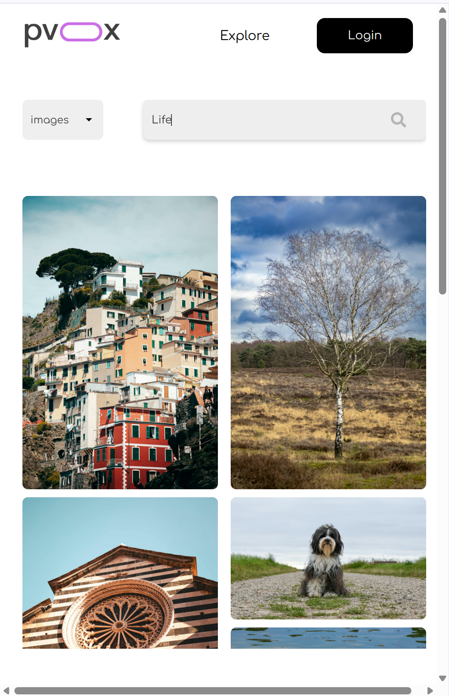

# PVOX 🎥📸  

PVOX is a **full-featured React-based web application** that enables users to explore and download **high-quality photos and videos** via the [Pexels API](https://www.pexels.com/api/).  
It demonstrates strong **frontend development skills**, API integration, and a focus on **responsive, user-friendly design**.  

---

 

## ✨ Key Features  

- 📸 **Browse & Download Media**  
  - Directly fetch and download curated images & videos from Pexels.  
  - Supports both photo and video formats with a smooth download experience.  

- ❤️ **Like & Dislike System**  
  - Built using **React state + localStorage**, ensuring liked items persist even after page refresh.  
  - Provides a personalized media experience.  

- 🔎 **Search & Filters**  
  - Users can search for any image via keywords.  
  - Dynamic filtering (category, type, etc.), works well in mobile, tablet, desktop.  

- 🚀 **Modern User Interface**  
  - Built with **React functional components and hooks** (`useState`, `useEffect`, `useRef`).  
  - Smooth **event listeners and hover effects** for better interactivity.  

- ⏳ **Loading States**  
  - Custom **PVOX Loader** ensures a polished experience while fetching content.  
  - Separate loaders for photos and videos.  

- ❌ **Error Handling**  
  - Custom **404 Page** for invalid routes (implemented via **React Router**).  
  - Graceful fallbacks when API fails or when no liked items exist.  

- 🎯 **Other Highlights**  
  - **Browser Router** for seamless navigation between pages.  
  - Optimized rendering with conditional checks and null handling.  
  - **Footer Section** with external links (GitHub, LinkedIn placeholder, docs).  

---

## 📷 Screenshots  

### 🏠 Home Page  
  

### 📑 Pagination  
  

### 🎬 Videos Loading  
  

### 🖼️ Photos Loading  
  

### 🖼️ Specific photo When Clicked  

### 🖼️ Similar Photos 

### 🖼️ Download Photos 

### ❤️ Liked Resources  
  

### 🛠️ Fetching Resources  
  

### 📱 Responsive Filters (Mobile)  
 

### 💻 Responsive Filters (Tablet)  
  

### ⚠️ 404 Error Page  
  

### 🎨 Footer  
  

### ⭐ Trending Section  
  

### 🖱️ Hover Effect  
  

### 📭 When Nothing is Liked  
  

---

## 🛠️ Tech Stack  

- **Frontend:** React.js (functional components, hooks, Router)  
- **API:** Pexels API (external data integration)  
- **State Management:** React `useState`, `useEffect`, and localStorage persistence  
- **Routing:** React Router (BrowserRouter, Route, ErrorPage)  
- **Styling:** CSS Modules / Responsive Design  
- **User Interaction:** Event listeners, hover effects, conditional rendering  

---

##  About the Project  

PVOX was built to demonstrate:  

- ✅ Strong **React fundamentals** (components, props, hooks, routing)  
- ✅ **Stateful applications** with persistent data using localStorage  
- ✅ Handling **API integration** (fetching, error handling, loaders)  
- ✅ Building a **responsive, user-friendly UI**  
- ✅ Attention to **UX details** (loaders, empty states, custom errors)  
- ✅ Writing clean, modular, reusable code  

This project highlights my ability to:  
- Work with real-world **APIs** and manage asynchronous data  
- Build responsive applications that scale across devices  
- Create a smooth **user experience** with loaders, errors, and interactive features  
- Deliver a complete, production-ready frontend solution  

---

##  Future Improvements  

- Add authentication system (user accounts for saving favorites in cloud)  
- Dark mode for better UX  
- Deploy live demo with CI/CD  
